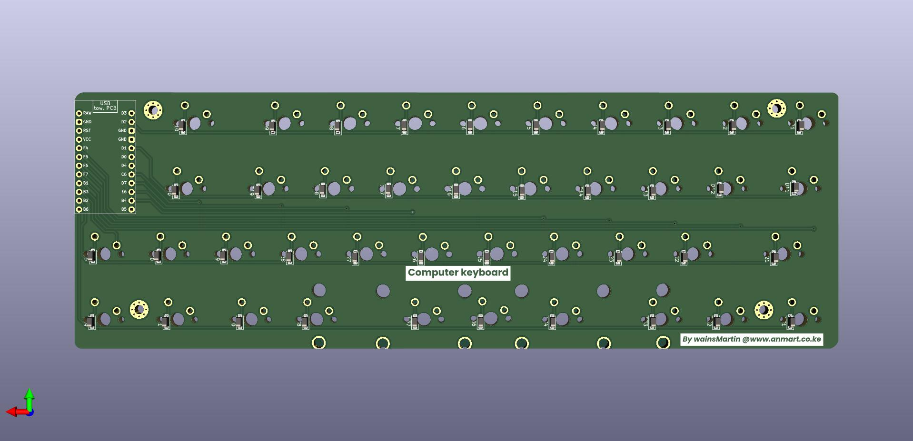

# Custom Mechanical Keyboard PCB Design

This repository contains the design files and resources for a custom mechanical keyboard PCB created using KiCad. The project includes schematics, PCB layout, and production files, aiming to make a fully functional and customizable mechanical keyboard.


## Project Overview

This keyboard design project includes:
- **Schematic Design**: Detailed layout of switches, diodes, and controller connections.
- **PCB Layout**: A compact and optimized PCB design suitable for mechanical switches.
- **Production Files**: Ready-to-use Gerber files and a BOM (Bill of Materials) for ordering components.

## Features

- **Hot-swappable Switches** (optional): Easy switch customization without soldering.
- **RGB Backlighting** (optional): Support for individually addressable RGB LEDs.
- **USB-C Interface**: Modern connectivity option.
- **Customizable Firmware**: Compatible with QMK or VIA for programmable key layouts.

## Folder Structure

- `schematics/`: KiCad schematic files for the keyboard circuit.
- `pcb_layout/`: KiCad PCB layout files with switch, diode, and microcontroller placements.
- `gerber_files/`: Gerber files for PCB manufacturing.
- `bom/`: Bill of Materials for sourcing components.

## Getting Started

1. Clone the repository:
   ```bash
   git clone 
   cd 
Open the project in KiCad by loading the .kicad_pro file in the root directory.

Make any modifications needed to suit your preferred keyboard layout.

## Usage
Editing the Schematic
Open the `schematics/` folder and modify connections or components as needed.

# PCB Layout
The `pcb_layout/` folder contains the PCB layout file, where you can make adjustments to the component placements or routing.

# Generating Gerber Files
After making changes, you can generate new Gerber files by:

1. Opening the PCB Editor in KiCad.
2. Going to File > Plot to export your Gerber files into the `gerber_files/` folder.

## License
This project is licensed under the MIT License 